# Multi-view Multi-class Datasets
This repo contains some benchmarks for evaluating Multi-view Multi-class machine learning algorithms.

## 📄 Statistics of Datasets
📢 More information about the datasets can be found in [[Google Sheets](https://docs.google.com/spreadsheets/d/15jSJqDot4-LPiX_GYSHJDkndXZGjYqOBm6LXl_j57U4/edit?usp=sharing) | [Tencent Docs](https://docs.qq.com/sheet/DY1lRV0VCcEJHcm5s?tab=BB08J2)].

|No. | Datasets |#Samples | #Classes | #Views| Tag | Reference |
|----|----|:----:|:----:|:----:|----|----|
|1|100Leaves|1,600|100|3|  | _Plant leaf classification using probabilistic integration of shape, texture and margin features_ |
|2|Caltech101-7|1,474|7|6| `imbalance` | _Large-scale multi-view spectral clustering via bipartite graph_ |
|3|Caltech101-20|2,386|20|6| `imbalance` | _Deep Incomplete Multi-View Learning Network with Insufficient Label Information_ |
|4|Caltech101|9,144|102|6| `imbalance` | _Binary Multi-View Clustering_ |
|5|Deep Caltech101|8,677|101|2| `imbalance` | _Trusted Multi-View Classification_ |
|6|Caltech256|30,607|257|3| `imbalance` |_Auto-weighted Multi-view Clustering for Large-scale Data_|
|7|Deep AWA_2views|10,158|50|2| `imbalance` |_Deep Partial Multi-View Learning_|
|8|Reuters_2views|18,758|6|2| `imbalance` |_Multi-view Spectral Clustering Network_|
|9|NoisyMNIST|70,000|10|2|  |_Robust Multi-View Clustering With Incomplete Information_|
|10|NoisyMNIST|30,000|10|2|  |_Robust Multi-View Clustering With Incomplete Information_|
|11|MNIST-USPS|5,000|10|2|  |_Robust Multi-View Clustering With Incomplete Information_|
|12|Scene15|4,485|15|3|  |_Ensemble projection for semi-supervised image classification_|
|13|Out-Scene|2,688|8|4|  |_Deep Incomplete Multi-View Learning Network with Insufficient Label Information_|
|14|NUS-WIDE|30,000|31|5| `imbalance` |_Fast Multi-view Clustering via Ensembles: Towards Scalability, Superiority, and Simplicity_|


✨ We have collated some publicly available datasets and you can download them from [Baidu Netdisk](https://pan.baidu.com/s/1hHN4P_6PaQtO_REbZdb9oQ?pwd=36gc). The data format is as follows:
```
xxx.mat
|---gnd: matrix, double, start from 1, (sample_number, 1).
|---X: cell, (1, view_num)
|---|---X{i}: matrix, double, (sample_number, feature_dimension).
```


## 🔥 Update
- [2024/08/12] The script for label distribution plot is uploaded `label_distribution/plot_label_distribution.ipynb`!
- [2024/08/08] Create a share link to datasets we have collected from the Internet for public research. [[Baidu Netdisk](https://pan.baidu.com/s/1hHN4P_6PaQtO_REbZdb9oQ?pwd=36gc)]


## 🌋 Modality Evaluation
We simply adopt the SVM as a baseline to evaluate the contribution of each modality for the classification task.


## 📊 Label Distribution

<p align = "center">
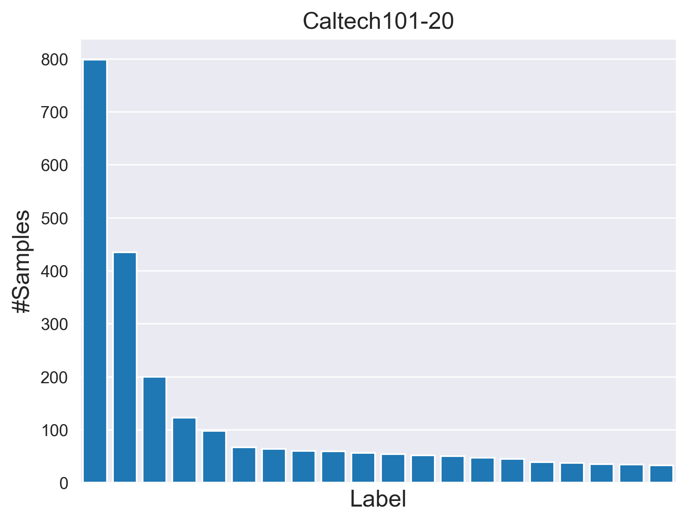
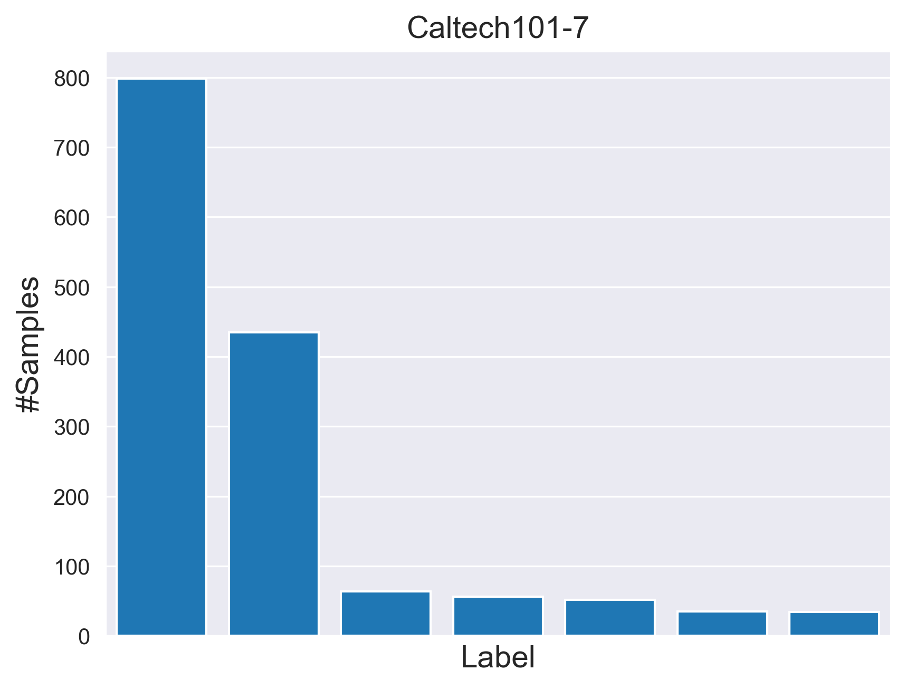
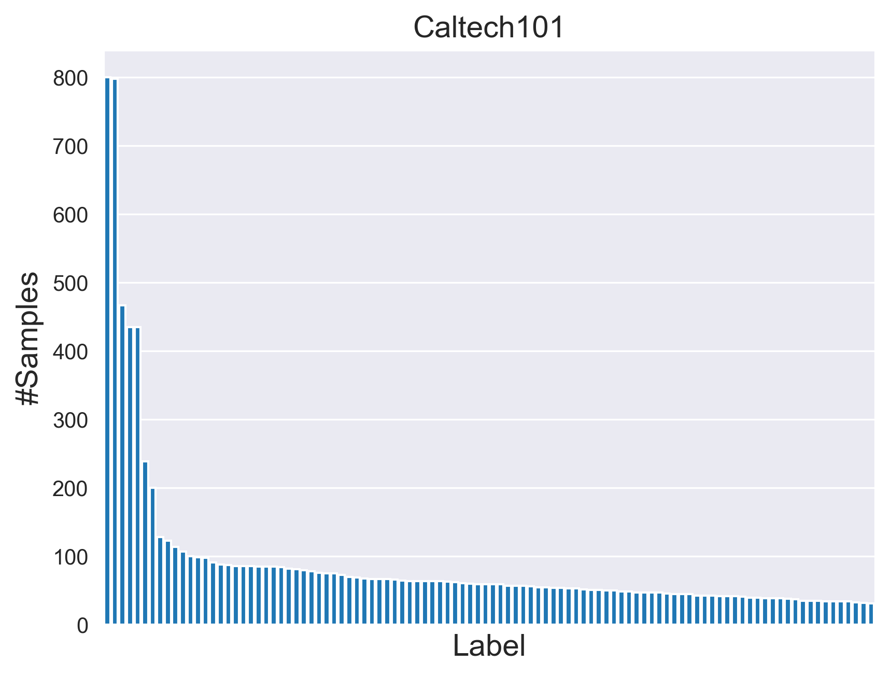
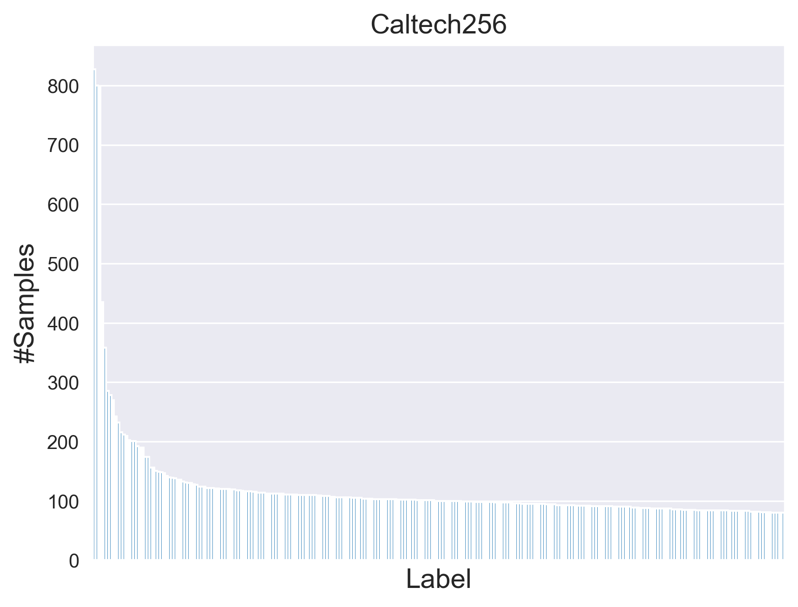
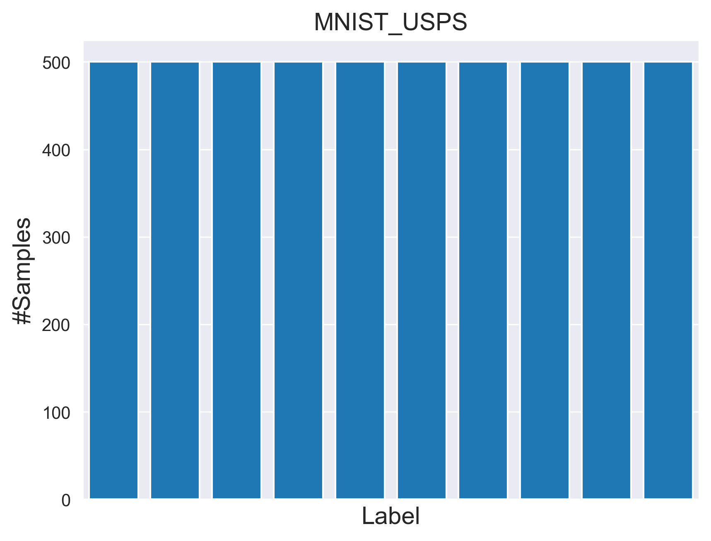
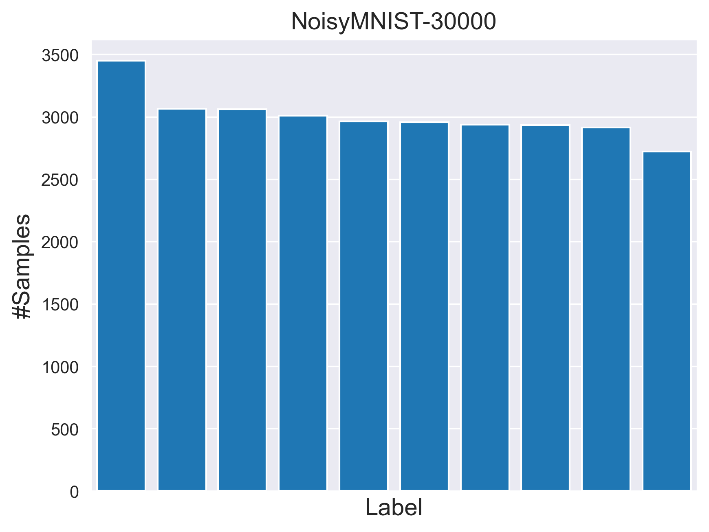
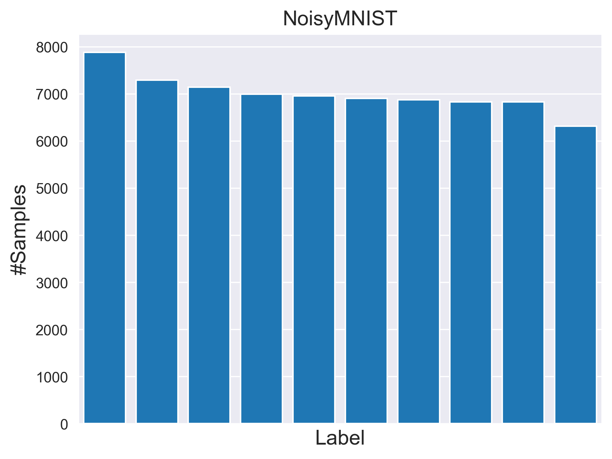
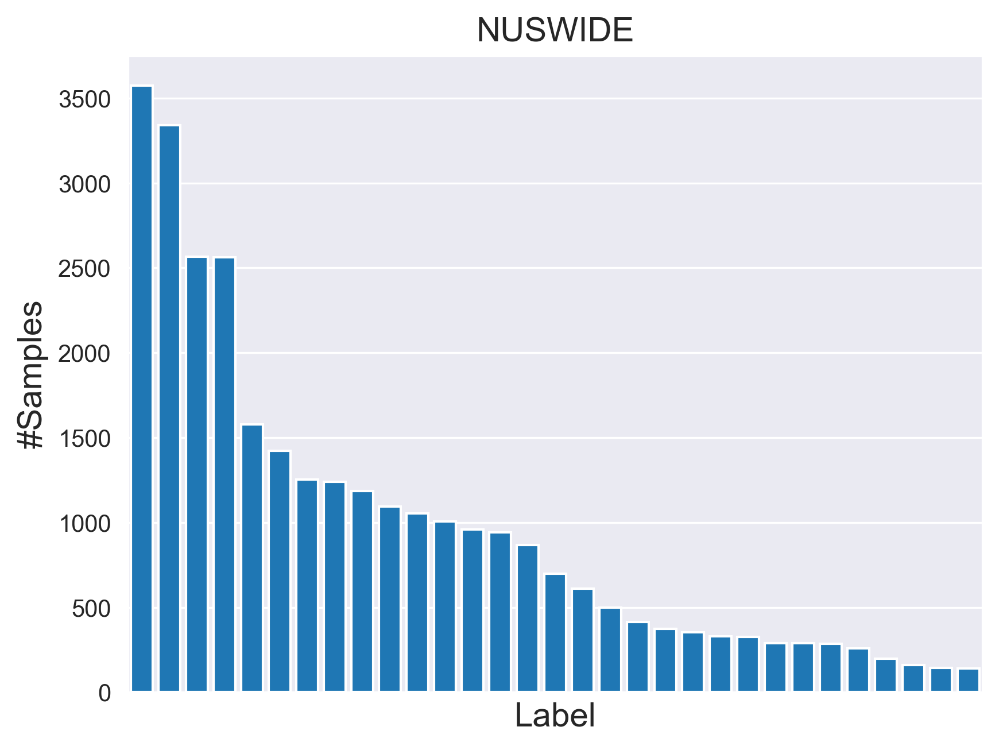
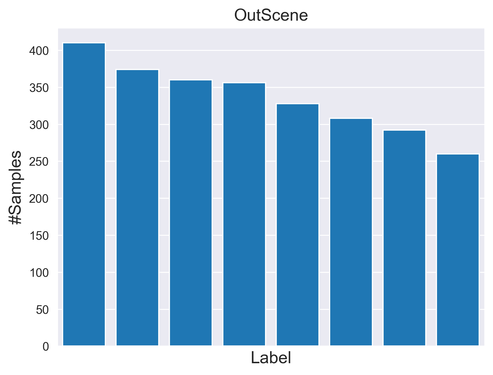
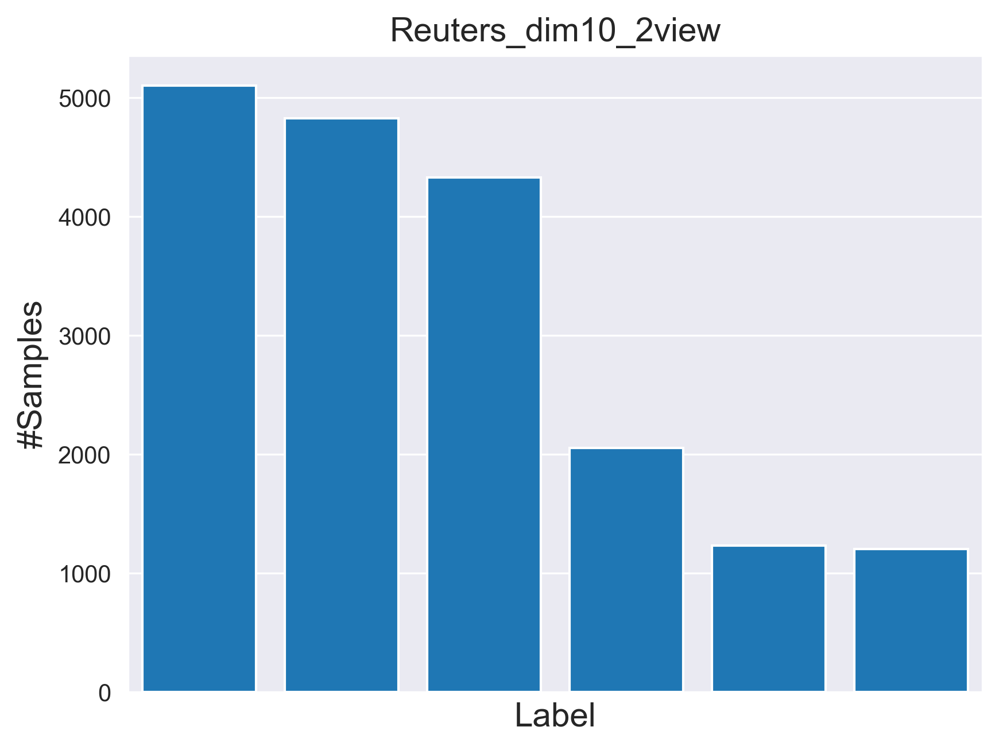
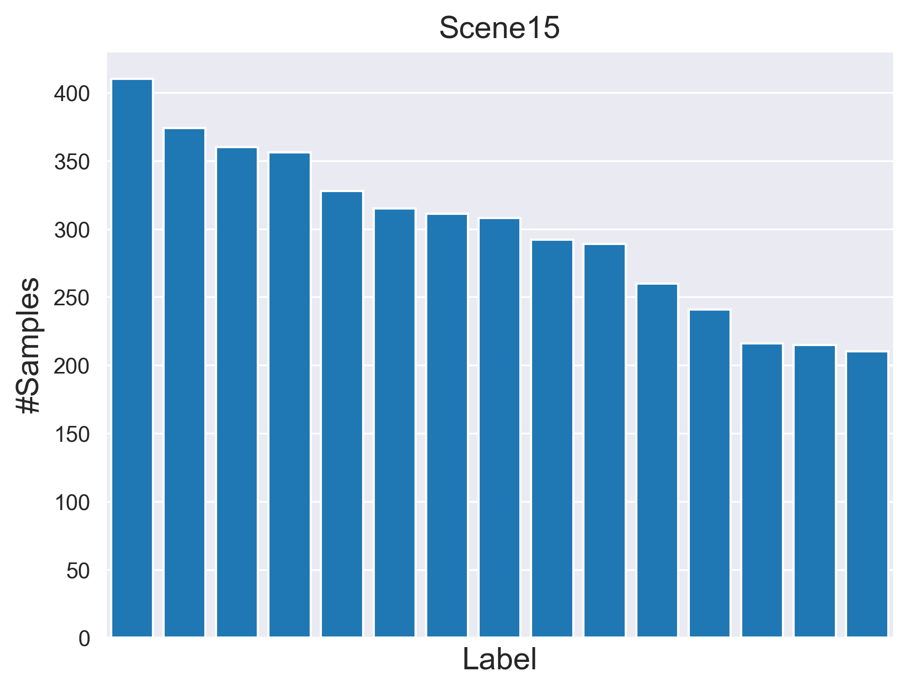
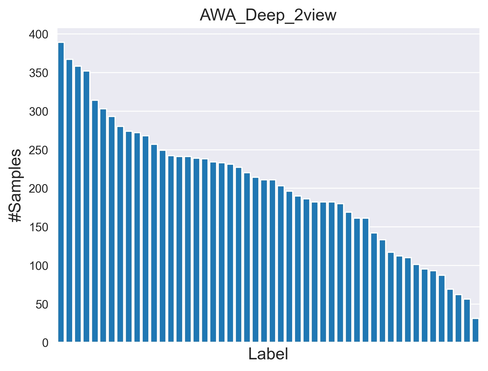
</p>

More figures can be found in fold `label_distribution`!

## Acknowledgements
Some datasets were downloaded from these sites, for which we are very grateful:

[1] [https://github.com/liujiyuan13/mvdata](https://github.com/liujiyuan13/mvdata)

[2] [https://github.com/wangsiwei2010/large_scale_multi-view_clustering_datasets](https://github.com/wangsiwei2010/large_scale_multi-view_clustering_datasets)


